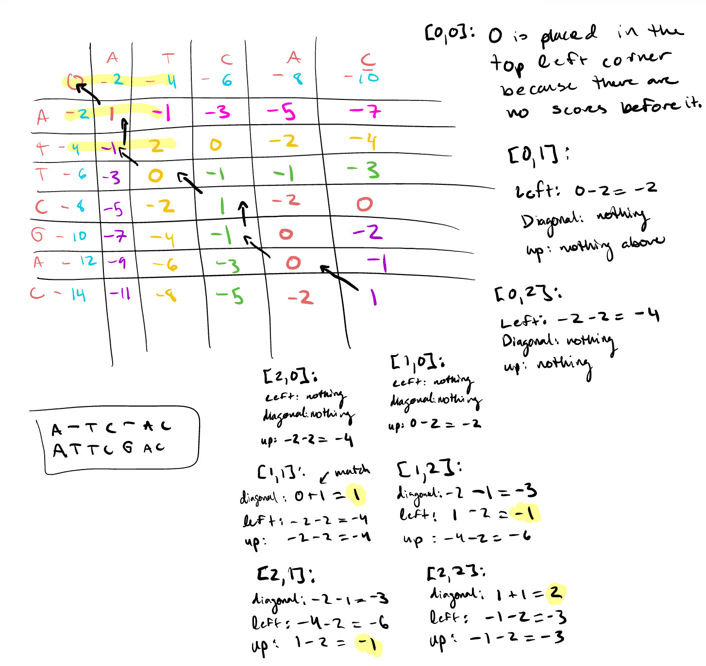

```{r setup, include=FALSE}
#Setting working directory
knitr::opts_knit$set(root.dir = "/Users/arabelatan/Desktop/[1] UBC/[3] Third Year/[1] First Term/BMEG 310/[3] Group Projects/Assignment 3")
```

## Q1: Why areas of the genome with high GC content are hard to sequence?

Areas in the genome with high G-C content are challenging to sequence because they have strong hydrogen bonds. These hydrogen bonds are stable, and therefore can form secondary structures. These structures do not respond to amplification, and therefore areas with high G-C content are challenging to accurately amplify. 

## Q2
{ width=85% }
\\

## Q3. Looking at the Metadata of an alignment (SAM) file

### Q3.1.
```{r}
single_cell_RNA_seq <- read.csv("single_cell_RNA_seq_bam.sam", nrows=73, sep="\t", header=FALSE,
fill=TRUE)
```

SN: Reference Sequence Name
LN: Reference Sequence Length

### Q3.2.
```{r}
print(paste("Length of X Chromosome:",single_cell_RNA_seq[single_cell_RNA_seq[,2]=="SN:X",3]))
```

## Q4. Looking at the Reads of an alignment (SAM) file

### Q4.1. 
```{r}
sam <- read.csv("single_cell_RNA_seq_bam.sam", sep="\t", header=FALSE,
comment.char="@", col.names = paste0("V",seq_len(30)), fill=TRUE)
sam <- sam[paste0("V",seq_len(11))]

print(paste("Number of Reads in the BAM file:", nrow(sam)))
```

### Q4.2. 
```{r}
print(sam[10,])
print("To find the chromosome to which the read was aligned, we should look at the 3rd column")
print("V11 corresponds to the the ASCII of the base quality plus 33")
```

### Q4.3.
```{r}
number_of_reads <- nrow(sam[sam[,3]=="X",])

print(paste("Number of reads in the file that align to chromosome X:",number_of_reads))
```

### Q4.4.
```{r Q4.4.}
#Isolating the Base Quality Reads of X-Chromosome
base_quality_read <- sam[sam[,3]=="X",]

#Creating a Data Frame to store the converted values
mean_bq <- data.frame("Read_Name:"=base_quality_read$V1)

#Going through each read
for (i in 1: number_of_reads){
  
  #Converting the ASCII Value into Base Quality
  bq_indiv_read <- as.numeric(charToRaw(base_quality_read[i, 11])) - 33
  
  #Adds the converted values in the dataframe
  mean_bq$Bq[i] <- I(list(bq_indiv_read))
  
  #Adds the mean base quality into the dataframe
  mean_bq$Mean_Base_Quality[i] <- mean(bq_indiv_read)
}

 print(paste("Mean of the Reads:", mean(mean_bq$Mean_Base_Quality)))
  
```

### Q4.5.
```{r}
#library(ggplot2)

#base_quality_read <- sam[sam[,3]=="X",]

#for(i in 1:100){
#boxplot(unlist(mean_bq$Bq[i]))
#}
#mean_bq$position <-sam$V4
#sam$V4
#order(mean_bq$Bq[1:100])
#data<-boxplot(mean_bq$Bq[1:100])

```

### Q4.6.
The column that contains the leftmost mapping position of the reads is the POS column, found in the fourth column.

### Q4.7.
```{r}
sam_9 <- sam[which(sam$V3 == 9 & sam$V4 >= 40801273 & sam$V4 <= 40805199), ]
length(sam_9$V4)
```

### Q4.8.
```{r}
#Number of reads that have mapping quality less than 50
mq_less50 <-nrow(sam[sam[5]<50,])

print(paste("Number of reads that have mapping quality of less than 50:", mq_less50 ))

```

### Q4.9.
```{r}
#Isolates the reads with mapping quality of less than 50
mapping_quality_data <- sam[sam$V5 < 50, ]

# Calculate the mean mapping quality for this subset
mean_mapping_quality <- mean(mapping_quality_data$V5)

#Prints the result
print(paste("Mean Mapping Quality of Reads:", mean_mapping_quality))
```

### Q4.10.
```{r}
tdTomato_reads <- sam[sam$V3 == "tdTomato", ]
num_tdTomato_reads <- nrow(tdTomato_reads)
print(paste("Number of reads aligning to tdTomato sequence:", num_tdTomato_reads))
```
Yes, because tdTomato is a fluorophore, it would emit fluorescence under the appropriate excitation light.

Adding a fluorophore like tdTomato allows researchers to visualize and track specific cells or gene expression under a microscope.

### Q5.1. 
```{r}
vcf_con <- file("RNA_seq_annotated_variants.vcf", open="r")
vcf_file <- readLines(vcf_con)
close(vcf_con)
vcf <- data.frame(vcf_file)
header <- vcf[grepl("##", vcf$vcf_file), ]
factor(header)
variants <- read.csv("RNA_seq_annotated_variants.vcf", skip=length(header),
header=TRUE, sep="\t")
```

```{r}
print(paste("The reference allele: ", variants[1,"REF"]))
print(paste("The alternative allele: ", variants[1,"ALT"]))

```

### Q5.2.
```{r}
#Using the ANN line of the VCF file to get column names for the dataframe. 
cols_divide <- strsplit(vcf[108,1], ":") #Isolate ANN line
cols_divide <- cols_divide[[1]] 
cols_divide <- cols_divide[2] #Getting the string after the :
col_names <- unlist(strsplit(cols_divide, "\\|")) #Separate that string by "\" and get a vector of strings. 

variants$INFO <- as.character(variants$INFO) 
info <- strsplit(variants[1,8],"ANN") #getting the first line of the variant after ANN
info_1  <- info[[1]]
info_ann <- info_1[2]
info_sep <- unlist(strsplit(info_ann, ",")) #Separate it by comma
info_ann_sep_1 <- unlist(strsplit(info_sep[1], "\\|")) #Then separate by "\" 
info_ann_sep_1[16] <- "" #add last element, was not included because it is empty. 

df <- as.data.frame(t(info_ann_sep_1)) #form df with first variant of ANN
colnames(df) <- col_names

df
```

### Q5.3. 
The annotation field tells us that the variant is an intron. Therefore this part of the sequence does not code protein. 
```{r}
print(df$` Annotation `) #prints the annotation field 
```

### Q5.4.
```{r}
variants$INFO <- as.character(variants$INFO)
info <- strsplit(variants[683,8],"ANN") #getting the 683 line of the variant after ANN
info_1  <- info[[1]]
info_ann <- info_1[2]
info_sep <- unlist(strsplit(info_ann, ","))
info_ann_sep_1 <- unlist(strsplit(info_sep[1], "\\|")) 
info_ann_sep_1[16] <- ""

df <- as.data.frame(t(info_ann_sep_1))
colnames(df) <- col_names
print(df$` Gene_Name `)
```

### Q5.5.
```{r}
variant_types<-c()

#Converting into character
INFO_field <- as.character(variants[,"INFO"])

#Isolating the variant's info field
VCF_df <- data.frame("INFO"=INFO_field)

for (j in 1:nrow(VCF_df)){
  
  #Separates by | to get the ANN information
  #[[1]] to access the value in the list
  Initial_split <- strsplit(INFO_field[j], split=",")[[1]]

  #Separates by ; to get individual variables
  Second_split <- strsplit(Initial_split,"\\|")

  #Goes through each variant file and separates by & to get individual variants
  for(i in 1:length(Second_split)){
    
    split_variants <- unlist(strsplit(Second_split[[i]][2], "&"))

    #Places the variant types in a vector
    variant_types<-c(variant_types,split_variants)
  }
}

#Gets a summary of the variant types
data.frame(table(variant_types))
```

###Q5.6
A frame shift variant is a variant that shifts all codons after that mutation because it is not a multiple of 3. Therefore entirely changing the protein made from that sequence, this causes more harm than mutations that are multiples of three as they only change one amino


### Q5.8
```{r}
high_impact_genes <- c()
moderate_impact_genes <- c()

for (i in 1:nrow(variants)) {
  info_field <- as.character(variants$INFO[i])
  info_parts <- strsplit(info_field, ";")[[1]]
  ann_field <- info_parts[grep("^ANN=", info_parts)]

  if (length(ann_field) > 0) {
    ann_value <- sub("ANN=", "", ann_field)
    annotations <- strsplit(ann_value, ",")[[1]]

    for (annotation in annotations) {
      annotation_details <- strsplit(annotation, "\\|")[[1]]
      impact <- annotation_details[3]
      gene_name <- annotation_details[4]
      feature_type <- annotation_details[8]
      
      if (impact == "HIGH" && feature_type == "protein_coding") {
        high_impact_genes <- c(high_impact_genes, gene_name)
      }

      if (impact == "MODERATE" && feature_type == "protein_coding") {
        moderate_impact_genes <- c(moderate_impact_genes, gene_name)
      }
    }
  }
}
unique_high_impact_genes <- unique(high_impact_genes)
unique_moderate_impact_genes <- unique(moderate_impact_genes)

cat("Unique genes affected by HIGH impact coding mutations:\n", unique_high_impact_genes, "\n\n")
cat("Unique genes affected by MODERATE impact coding mutations:\n", unique_moderate_impact_genes, "\n")
```